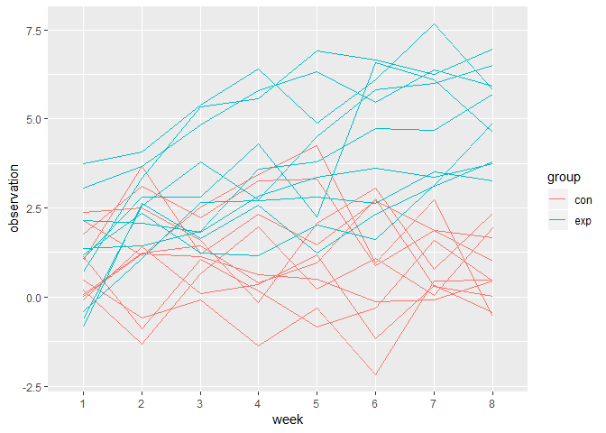

p8105\_hw5\_ml4239
================

``` r
data = 
  tibble(file_name = list.files(path = './data')) %>% 
  mutate(name = map(.x = str_c("./data/", file_name),~read.csv(.x))) %>% 
  unnest() %>% 
  separate(file_name, into = c("group", "id"), sep = "_",remove = F) %>% 
  gather(key = week, value = observation, week_1:week_8) %>% 
  mutate(week = str_replace(week, "week_", ""),
         file_name = str_replace(file_name, ".csv", ""),
         id = str_replace(id, ".csv", "")) 

data %>% 
  ggplot(aes(x = week, y = observation, group = file_name, col = group))+
  geom_line()
```


