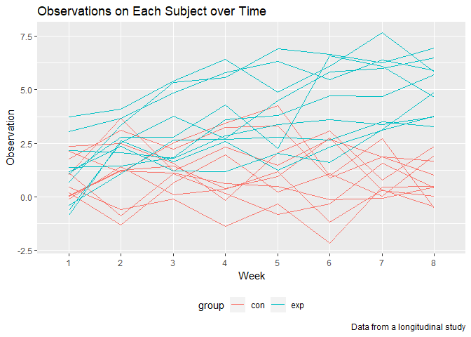
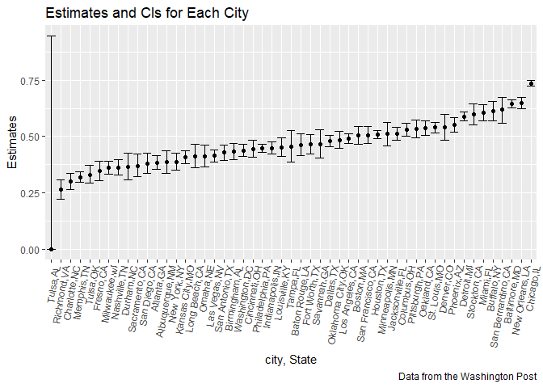

p8105\_hw5\_ml4239
================
Man Luo
2018/11/7

P.1
---

### import and tidy data

``` r
data = 
  tibble(file_name = list.files(path = './data/P1')) %>% 
  mutate(name = map(.x = str_c("./data/P1/", file_name),~read_csv(.x))) %>% 
  unnest() %>% 
  separate(file_name, into = c("group", "id"), sep = "_",remove = F) %>% 
  gather(key = week, value = observation, week_1:week_8) %>% 
  mutate(week = str_replace(week, "week_", ""),
         file_name = str_replace(file_name, ".csv", ""),
         id = str_replace(id, ".csv", "")) 

data
```

    ## # A tibble: 160 x 5
    ##    file_name group id    week  observation
    ##    <chr>     <chr> <chr> <chr>       <dbl>
    ##  1 con_01    con   01    1            0.2 
    ##  2 con_02    con   02    1            1.13
    ##  3 con_03    con   03    1            1.77
    ##  4 con_04    con   04    1            1.04
    ##  5 con_05    con   05    1            0.47
    ##  6 con_06    con   06    1            2.37
    ##  7 con_07    con   07    1            0.03
    ##  8 con_08    con   08    1           -0.08
    ##  9 con_09    con   09    1            0.08
    ## 10 con_10    con   10    1            2.14
    ## # ... with 150 more rows

### make a spaghetti

``` r
data %>% 
  ggplot(aes(x = week, y = observation, group = file_name, col = group))+
  geom_line() +
  labs(
    title = "Observations on Each Subject over Time",
    x = "Week",
    y = "Observation",
    caption = "Data from a longitudinal study") +
  theme(legend.position = "bottom")
```



**Comments**The control group has a lower observation data compared to experiment arm. Even thought control and experiment arms might have similar observations for the first several weeks, with the time goes, control group has a lower observations in the end.

P.2
---

### Describe the raw data.

``` r
homicide_data <- read_csv('./data/P2/homicide-data.csv') 
```

The raw data contains 52179, 12 observations including 52179 people with 12 variables. The variables includes:uid, reported\_date, victim\_last, victim\_first, victim\_race, victim\_age, victim\_sex, city, state, lat, lon, disposition

### Create a city\_state variable & Summarize total\_homicides, unsolved\_homicides within cities

``` r
homicide_data_city_state<-homicide_data %>%  
  mutate(city_state = str_c(city, ",", state)) 

  
homicide_num<-homicide_data_city_state %>%   
  group_by(city_state) %>%
  summarise( total_homicide = n(),
    unsolved_homicide = sum(disposition == "Closed without arrest" | disposition == "Open/No arrest")) 

homicide_num
```

    ## # A tibble: 51 x 3
    ##    city_state     total_homicide unsolved_homicide
    ##    <chr>                   <int>             <int>
    ##  1 Albuquerque,NM            378               146
    ##  2 Atlanta,GA                973               373
    ##  3 Baltimore,MD             2827              1825
    ##  4 Baton Rouge,LA            424               196
    ##  5 Birmingham,AL             800               347
    ##  6 Boston,MA                 614               310
    ##  7 Buffalo,NY                521               319
    ##  8 Charlotte,NC              687               206
    ##  9 Chicago,IL               5535              4073
    ## 10 Cincinnati,OH             694               309
    ## # ... with 41 more rows

### Estimate the proportion of homicides that are unsolved for the city of Baltimore, MD

``` r
homicide_num_MD =  homicide_num %>%
  filter(city_state == "Baltimore,MD")

  prop.test(homicide_num_MD$unsolved_homicide, homicide_num_MD$total_homicide) %>% 
    broom::tidy() %>% 
    select(estimate, conf.low, conf.high) %>% 
  knitr::kable()
```

|   estimate|   conf.low|  conf.high|
|----------:|----------:|----------:|
|  0.6455607|  0.6275625|  0.6631599|

### Prop.test for each of the cities

``` r
prop_city = function(x, y){
  
  selection = prop.test(x,y) %>% 
    broom::tidy() %>% 
  select(estimate, conf.low, conf.high)
  
  selection
  
}

prop_city<-map2(.x = homicide_num$unsolved_homicide, .y = homicide_num$total_homicide, ~prop_city(.x, .y)) %>% 
  bind_rows() %>% 
  mutate(city_state = homicide_num$city_state) %>% 
  select(city_state, everything()) 

prop_city
```

    ## # A tibble: 51 x 4
    ##    city_state     estimate conf.low conf.high
    ##    <chr>             <dbl>    <dbl>     <dbl>
    ##  1 Albuquerque,NM    0.386    0.337     0.438
    ##  2 Atlanta,GA        0.383    0.353     0.415
    ##  3 Baltimore,MD      0.646    0.628     0.663
    ##  4 Baton Rouge,LA    0.462    0.414     0.511
    ##  5 Birmingham,AL     0.434    0.399     0.469
    ##  6 Boston,MA         0.505    0.465     0.545
    ##  7 Buffalo,NY        0.612    0.569     0.654
    ##  8 Charlotte,NC      0.300    0.266     0.336
    ##  9 Chicago,IL        0.736    0.724     0.747
    ## 10 Cincinnati,OH     0.445    0.408     0.483
    ## # ... with 41 more rows

### Create a plot that shows the estimates and CIs for each city

``` r
prop_city %>% 
  ggplot(aes(x = reorder(city_state, estimate), y = estimate)) +
  geom_point() +
  geom_errorbar(aes(ymin = conf.low, ymax = conf.high)) +
  theme(axis.text.x = element_text(angle = 80, hjust = 1))+
  labs(
    title = "Estimates and CIs for Each City",
    x = "city, State",
    y = "Estimates",
    caption = "Data from the Washington Post")
```


